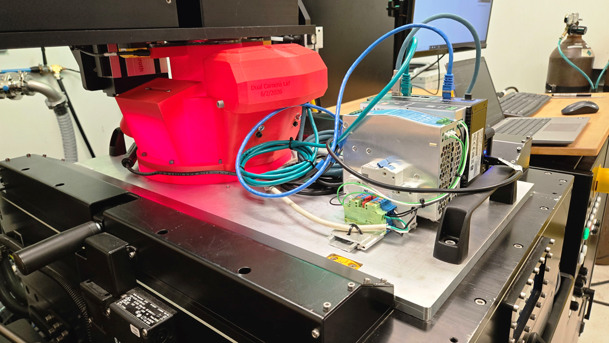

# Dataset LPBF Thin Wall and Cube Thermal Optical Monitoring
This dataset contains in situ thermal and layerwise thermal and optical images (as well as other project files) obtained during the in situ monitoring of an LPBF build session.

   
Setup of the in situ monitoring system for laser-based powder bed fusion additive manufacturing.  

## [Data](data)
Thermal and optical monitoring data collected during the LPBF builds.

## [Experimental Setup](experimental_setup)
Images, diagrams, hardware documentation, LabVIEW code, camera acquisition scripts, and other files used to configure and operate the experimental setup. Additional system design information is available [here]([experimental_setup](https://github.com/ARTS-Laboratory/LPBF-Observer)).

## [Build Files](build_files)
CAD, CAM, and other build files defining the printed specimens, scan paths, process parameters, and related build configurations.

## Licensing and Citation
This work is licensed under a Creative Commons Attribution-ShareAlike 4.0 International License [cc-by-sa 4.0].

#### Bibtex

@Misc{ARTSLabDatasetDatasetLPBFThin,  
  author = {{ARTS-L}ab},  
  title  = {Dataset LPBF Thin Wall and Cube Thermal Optical Monitoring},  
  groups = {{ARTS-L}ab},  
  note = {Accessed: 20xx-xx-xx},  
  url    = {https://github.com/Dataset-LPBF-Thin-Wall-and-Cube-Thermal-Optical-Monitoring},  
}  

QR code for repo.

